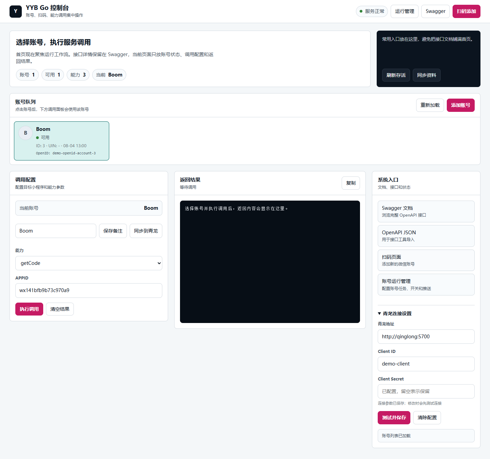
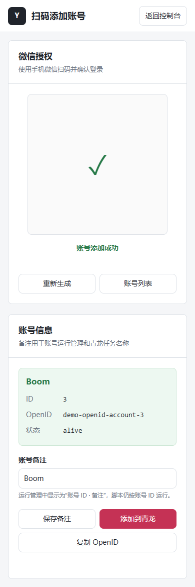
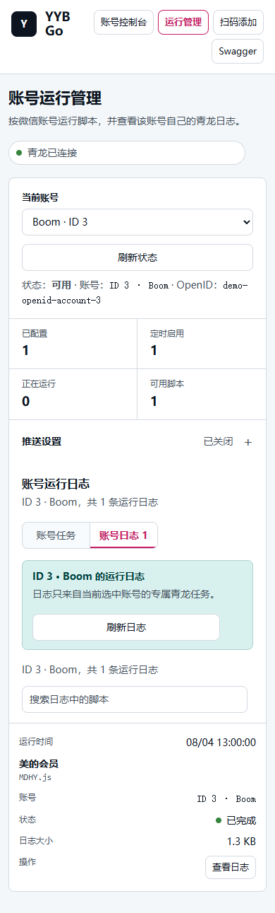

# YYB Go Enhanced

主要功能变化请查看 [更新日志](CHANGELOG.md)。

应用宝协议服务增强版，提供微信扫码登录、账号与 OpenID 管理、`wx.login` code 获取、凭据按需续期、带用户权限的 Web 控制台，以及 Docker 和面板接入。

## 功能

- 支持本机微信快速授权和手机扫码添加账号，授权成功后显示账号 ID、OpenID 和存活状态
- 扫码成功后可填写账号备注，并一键合并到面板 `YYB_SERVER`，重复操作不会产生重复账号
- Web 控制台支持配置 **青龙面板** 与 **呆呆面板 (daidai-panel)** OpenAPI，支持自动识别与测试连接，且不会回传 Secret 明文
- Web 控制台管理账号并复制 OpenID
- 提供 `/wx/*` 和 `/wxapp/*` 两套兼容接口：小程序 code、用户信息、手机号、加密 Key、云函数、二维码授权、文章会话/扩展数据/点赞
- 应用宝短期凭据接近失效时由后台任务主动续期，业务调用失败时也会按需续期
- SQLite 持久化账号与协议会话
- 独立登录与注册页面，支持管理员、普通用户、用户启停、密码重置和会话管理
- 统一管理平台外壳：固定侧栏、页面顶栏、用户身份区和移动端抽屉导航，账号、运行、用户与设置不再是相互独立的页面
- 用户、角色和网页登录会话默认存储在 SQLite，也可切换到 MySQL；微信协议数据继续使用独立 SQLite
- 支持与青龙容器共享 Docker 网络
- 账号运行管理：每个微信账号独立创建、启停和运行青龙脚本，并查看日志
- 运行日志使用独立抽屉连续刷新，保持阅读位置；支持超过 2 MB 的青龙日志索引响应
- 账号独立推送：支持 Server酱、PushPlus 和企业微信机器人，密钥只保存在青龙环境变量

## 界面



<p align="center">
  
  
</p>

## Docker Compose 部署

运行环境需要 Docker、Docker Compose，以及名为 `qinglong_default` 的 Docker 网络。如果没有青龙，也可以先创建同名网络：

```bash
docker network create qinglong_default
```

创建本地配置：

```bash
cp .env.example .env
```

公开版本默认使用 SQLite，无需单独部署数据库。编辑 `.env` 时保留：

```dotenv
YYB_AUTH_DRIVER=sqlite
YYB_AUTH_DSN=
YYB_COOKIE_SECURE=false
```

认证数据库默认保存为持久化卷中的 `resource/db/auth.db`。首次打开控制台注册的第一个账号会自动成为管理员，后续注册账号为普通用户。也可以在首次启动前设置 `YYB_ADMIN_USER` 和 `YYB_ADMIN_PASSWORD` 来预先创建管理员。

构建并启动：

```bash
docker compose up -d --build
```

默认访问地址为 `http://服务器IP:8000`。Nginx Basic Auth 已由应用内登录页面替代。

需要复用 MySQL 时，设置以下变量并确保 `yyb-go` 与 MySQL 容器位于同一 Docker 网络：

```dotenv
YYB_AUTH_DRIVER=mysql
YYB_AUTH_DSN=yyb_go:数据库密码@tcp(mysql:3306)/yyb_go?charset=utf8mb4&parseTime=true&loc=UTC
```

旧变量 `YYB_AUTH_MYSQL_DSN` 继续兼容：只设置该变量时会自动选择 MySQL，不会迁移或覆盖已有用户。`YYB_AUTH_DRIVER=none` 可关闭网页登录认证，仅建议用于受保护的本机调试。`YYB_COOKIE_SECURE` 仅在 HTTPS 反代下设为 `true`。

## Magisk 模块（实验性）

`feature/magisk-module` 分支提供 Android ARM64 的 Magisk 常驻模块，开机后由 `late_start service` 直接运行 YYB Go，不依赖 Termux。默认控制台为 `http://127.0.0.1:8000`，账号数据持久化在 `/data/adb/yyb-go`。构建、安装和安全限制见 [Magisk 模块文档](docs/magisk.md)。该模块完成了交叉编译和安装包结构验证，正式发布前仍需在 Root 真机上测试。

### 用户与权限

- 第一个管理员可由 `YYB_ADMIN_USER`、`YYB_ADMIN_PASSWORD` 初始化；未设置时首个注册账号成为管理员。
- 后续注册账号默认为普通用户，只能进入个人设置、修改密码和管理自己的会话。
- 管理员可访问微信账号、扫码、协议调试、面板运行管理和用户管理，并可关闭公开注册。
- `/wx/*`、`/wxapp/*` 保持给青龙脚本调用，不要求浏览器 Cookie；不要直接将这些协议接口暴露到公网。
- 修改密码会注销该用户的其他会话；管理员重置密码或停用用户会注销该用户全部会话。

### GitHub Actions 自动与手动构建镜像

项目已添加自动与手动构建 Docker 镜像的 Workflow (`.github/workflows/docker-publish.yml`)，支持打包发布到 **GitHub Container Registry (GHCR)**：

- **手动触发构建**：在 GitHub 仓库页面进入 **Actions** -> 选择 **Build and Publish Docker Image** Workflow -> 点击 **Run workflow**，可自定义填入镜像 Tag（默认 `latest`）并一键构建发布。
- **自动触发构建**：当推送分支到 `main` 或推送版本 Tag (如 `v1.0.0`) 时自动触发镜像构建。
- **支持架构**：多架构支持 (`linux/amd64`, `linux/arm64`)。

## 本机微信快速授权

在 Windows 电脑上打开 YYB Go 的“添加微信账号”页面时，页面会尝试连接当前电脑已登录的微信客户端。检测成功后，点击“使用本机微信授权”，在电脑微信中确认即可；不需要用手机扫描二维码。

该能力复用了微信开放平台网页授权的 `fast_login` 流程。浏览器只与本机微信通信，并把微信返回的一次性回调地址交给 YYB Go；账号凭据仍由 YYB Go 服务端换取和保存。服务端会校验回调协议、域名、路径和 `state`，且快速授权会话只能使用一次。

使用条件与限制：

- 仅桌面微信客户端支持，本机微信需保持登录且未锁定。
- 浏览器必须允许访问 `https://localhost.weixin.qq.com`。企业安全策略、浏览器本地网络访问限制或微信版本不支持时，检测会失败。
- 检测失败会自动切换到原有扫码授权，不影响手机扫码登录。
- 快速授权最终仍需要用户在微信中确认，不能在无交互的情况下静默登录。

如果只允许某个局域网地址监听，可设置：

```dotenv
YYB_BIND_ADDRESS=192.168.1.10
```

## 自动保活

服务默认每 30 分钟检查一次账号，并在 access token 剩余不足 45 分钟时，通过 refresh token 更新 access token、refresh token 和 login buffer。该过程不会生成未消费的 `wx.login` code。

可以在 `.env` 中调整：

```dotenv
YYB_KEEPALIVE_INTERVAL=30m
YYB_KEEPALIVE_AHEAD=45m
```

将 `YYB_KEEPALIVE_INTERVAL` 设为 `0` 可关闭后台保活。提前续期遇到临时网络失败时会保留当前账号状态并在后续周期重试；凭据真正过期或 refresh token 被服务端撤销后仍然需要重新扫码。

## 青龙与呆呆面板接入

支持对接 **青龙面板 (Qinglong)** 与 **呆呆面板 (daidai-panel)**：

- **Web 控制台配置**：可在 Web 控制台的“面板连接设置”中选择【青龙面板】或【呆呆面板 (daidai-panel)】，填入面板地址与对应的鉴权凭据（青龙使用 `Client ID` / `Client Secret`；呆呆面板使用 `App Key` / `App Secret`）。配置会持久化到 SQLite 数据库并优先于容器环境变量。
- **连接类型识别**：保存连接时若面板类型选错，且当前地址返回 `404` 或 `405`，系统会尝试另一种驱动；识别成功后使用正确的面板类型。
- **青龙环境变量配置**：
  ```dotenv
  PANEL_TYPE=qinglong
  QL_URL=http://qinglong:5700
  QL_CLIENT_ID=你的青龙ClientID
  QL_CLIENT_SECRET=你的青龙ClientSecret
  ```
- **呆呆面板环境变量配置**：
  ```dotenv
  PANEL_TYPE=daidai
  DAIDAI_URL=http://daidai-panel:5700
  DAIDAI_APP_KEY=你的呆呆面板AppKey
  DAIDAI_APP_SECRET=你的呆呆面板AppSecret
  ```

升级前已经使用青龙的部署不需要迁移配置，原有 `QL_URL`、`QL_CLIENT_ID` 和 `QL_CLIENT_SECRET` 会继续生效。面板适配层会分别处理青龙和呆呆的任务启停、运行状态与日志接口，避免混用两种面板不同的状态字段。

扫码成功页和账号控制台都提供“添加/同步到面板”按钮。同步会保留 `YYB_SERVER` 中已有的多行内容和环境变量备注，只追加缺少的账号，并同时识别账号 ID 与 OpenID，避免重复添加。

当面板和本服务都连接到 `qinglong_default` 网络后，面板环境变量可以填写：

```text
YYB_SERVER=yyb-go:8000@1
```

`@` 后可以使用控制台显示的账号 ID 或 OpenID。账号 ID 是本地数据库编号，删除并重新添加账号后可能变化；OpenID 更适合长期配置。

已确认报错的青龙/呆呆面板脚本修复版收录在 [`scripts/`](scripts/README.md)。

## API 示例

截图中的短路径均已提供兼容入口：

```text
/wx/code             获取小程序 code
/wx/getuserinfo      获取 YYB 账号用户信息
/wx/encryptkey       获取用户加密 Key（默认通过 operateWxData 调用）
/wx/getphonenumber   获取手机号
/wx/cloud            云函数（通过 operateWxData 传递 payload）
/wx/qrcodeauth       二维码授权会话
/wx/mpgeta8key       文章会话（通过 operateWxData 传递 payload）
/wx/appmsgext        文章扩展数据（通过 operateWxData 传递 payload）
/wx/appmsglike       文章点赞（通过 operateWxData 传递 payload）
```

这些接口不会伪造微信返回值。`/wx/cloud`、`/wx/mpgeta8key`、`/wx/appmsgext` 和 `/wx/appmsglike` 需要调用方在 `payload` 中提供目标小程序实际支持的 `api_name`、`data` 等字段，例如：

```json
{
  "ref": "1",
  "app_id": "wx0000000000000000",
  "payload": {
    "api_name": "callFunction",
    "data": {"name": "签到", "data": {}}
  }
}
```

若目标接口不是 `operateWxData` 能力，服务端会原样返回微信协议的错误，需根据该小程序抓包请求补充真实字段。

获取 `wx.login` code：

```bash
curl -X POST http://yyb-go:8000/wxapp/getCode \
  -H 'Content-Type: application/json' \
  -d '{"ref":"1","app_id":"wx0000000000000000"}'
```

主动刷新单个账号状态：

```bash
curl -X POST http://yyb-go:8000/accounts/refresh \
  -H 'Content-Type: application/json' \
  -d '{"ref":"1"}'
```

Web 控制台内还提供完整的 OpenAPI 文档入口。

## 账号运行管理

在 `.env` 中配置青龙 OpenAPI 后，打开 `/runs`：

```dotenv
QL_URL=http://qinglong:5700
QL_CLIENT_ID=你的青龙应用 Client ID
QL_CLIENT_SECRET=你的青龙应用 Client Secret
YYB_QINGLONG_SERVER=yyb-go:8000
YYB_QINGLONG_REPO=SuperNaiBA_YYB-GO-Script,525815266_YYB-Go-Enhanced/scripts
```

`YYB_QINGLONG_REPO` 填青龙定时任务命令中 `task` 后面的仓库目录，多个目录用英文逗号分隔。通过本仓库订阅脚本时通常为 `525815266_YYB-Go-Enhanced/scripts`；通过上游脚本仓库订阅时为 `SuperNaiBA_YYB-GO-Script`。

管理页发现上述仓库目录中的 `.js` 和 `.py` 任务。每个“账号 + 脚本”会创建一个独立青龙任务，新任务默认关闭；手动点击“运行一次”才会立即执行。账号变量通过青龙 `task_before` 注入，运行日志按“账号 + 脚本”写入独立目录，管理页只读取当前账号的目录。账号推送 Token 不写入任务命令和 YYB 数据库，接口也不会返回明文。

如果原订阅生成的全局任务仍在运行，管理页会显示重复运行提示。迁移到账号任务后，请在青龙中停用对应的旧全局任务。

## 数据与安全

- 不要提交 `.env`、`data/`、SQLite 数据库、登录凭据或真实 OpenID。
- 建议仅在可信局域网内运行，不要把内部的 `yyb-go:8000` 接口直接暴露到公网。
- `wx.login` code 是短期且一次性的；refresh token 也可能被服务端撤销，失效后需要重新扫码。
- 本项目仅供学习和个人研究使用，请遵守相关平台条款及所在地法律法规。

## 来源说明

本项目基于 [SuperNaiBA/YYB_GO](https://github.com/SuperNaiBA/YYB_GO) 整理和增强，主要补充了账号信息展示、OpenID 可见性、Web 控制台资源修复、Docker 部署与访问保护。请同时遵守上游项目的授权条件；如需分发或商业使用，请先取得相应权利人的许可。
